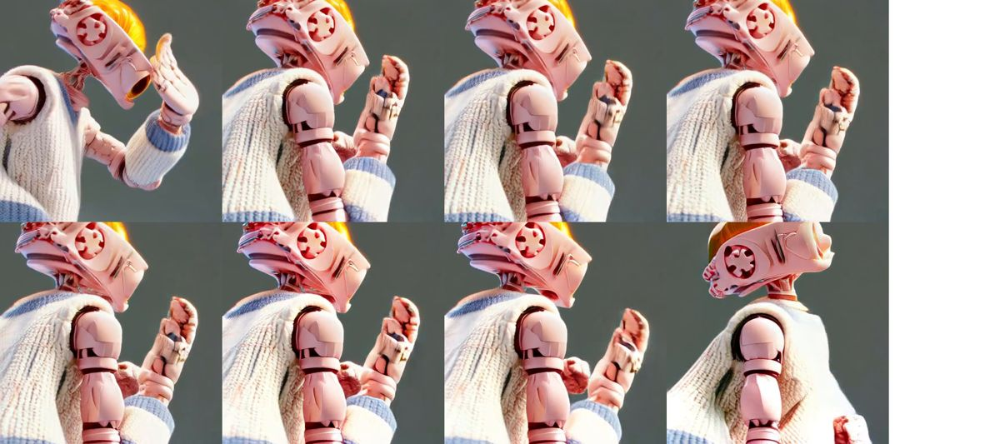

# Wan Animate 與 SCAIL-2 實驗紀錄（2026-10-06）

## 範圍與結論摘要

本次實驗於 2026-10-06 在 RTX 4080 16GB 裝置上，驗證了 Wan Animate 2-segment 延伸（61 幀）搭配源音軌保留、非正方形解析度（384×640），以及首度安裝執行 SCAIL-2 FP8 模型的技術可行性。六個候選（Mix61+音訊、Move61、Move17 384x640、SCAIL-2 replace33／replace61／animate33）均完整解碼通過，但內容品質（手部變形、身份漂移、鏡頭對應）仍待使用者驗收，維持 candidate 狀態。

## 共同條件

**裝置與環境**
- 硬體：RTX 4080（16,376 MiB VRAM）、31.1 GiB RAM
- ComfyUI：版本 12d5279438bfefc058a269eae805ceab6047777f（v0.34.0）、執行於 http://127.0.0.1:8188
- 執行方式：維護專用 harness `output/api_validate.py`（Python 標準庫 urllib，放在 ignored `output/`），步驟與技能文件的直接 HTTP 流程相同（GET /object_info preflight、POST /upload/image、POST /prompt、輪詢 GET /history/{prompt_id}、GET /view），非產線客戶端

**共用輸入**
- 參考圖：官方機器人參考圖，SHA-256 `9a461263abd4279e71bff631a50bdca1809ecf1505646628dfcea73f2548ed18`
- 來源影片：官方樣本片段 frames 64..124（61 幀、640×640 16 FPS CFR，重編為 61 幀，混入合成 440 Hz 單聲道 AAC 測試音軌），檔案 output/wan-animate-extend/source61-tone.mp4，SHA-256 `1d05e47fbc7cb7a74429e552ff45787197cd560180e0f89b5bc657d55c3ebe2f`
- seed：20261006（延伸段兩段同 seed）
- Wan Animate 正向 prompt（三支相同）：`A pink metal robot with a camera-shaped mechanical head, wearing a white and blue knitted sweater and yellow trousers. Its camera-shaped head, metal body and clothing remain consistent throughout the clip. The robot follows the head and hand movements shown in the driving video. The shot is a close-up of its upper body.`；負向沿用 template 內官方中文負向 prompt
- Wan Animate Mix SAM 點位：positive `[{"x":192,"y":192}]`（第一幀人臉）、negative `[{"x":30,"y":30}]`（左上背景）
- SCAIL-2 替換 prompt：`A pink metal robot with a camera-shaped mechanical head, wearing a white and blue knitted sweater, moves its head and hands in a close-up shot against a plain grey-blue background. Its camera-shaped head, metal body and clothing stay consistent throughout the clip.`
- SCAIL-2 動畫 prompt：`A pink metal robot with a camera-shaped mechanical head, wearing a white and blue knitted sweater and yellow trousers, moves its head and hands. Its camera-shaped head, metal body and clothing stay consistent throughout the clip. Plain light blue background.`
- SCAIL-2 SAM3 文字：來源 `person`、參考圖 `robot`；負向 prompt 空字串
- 執行日期：2026-10-06

## 候選總表

| 候選 | 模型／Template | 改動 | 輸出 | Prompt ID | Server執行秒 | 技術 | 內容狀態 |
|---|---|---|---|---|---:|---|---|
| Mix61+音訊 | mix-extend-api.json | 延伸段 + 音訊連線 node 15 | 384×384／61幀／AAC 3.82s | `f15941e6-27a9-4a80-a073-ee2aaaf98c1c` | 95.5 | pass | candidate |
| Move61 | move-extend-api.json | 延伸段 | 384×384／61幀 | `aa2550ec-1135-4213-8188-8f04d2145ec8` | 42.0 | pass | candidate |
| Move17 384×640 | move-api.json，寬高改 384×640 | 直式非正方形 | 384×640／17幀 | `db670069-2278-495c-8961-9977a577311b` | 18.0 | pass | candidate |
| SCAIL-2 replace33 | scail2-api.json | 角色替換，首次載入模型 | 384×384／33幀 | `624c9e12-4227-44e6-8cad-4dbb7cb1f1ec` | 68.1 | pass | candidate |
| SCAIL-2 replace61 | scail2-extend-api.json | 角色替換，延伸段 | 384×384／61幀 | `1da41c66-4300-4a9d-8c34-32fc835acd96` | 39.8 | pass | candidate |
| SCAIL-2 animate33 | scail2-api.json，replacement_mode=false | 角色動畫 | 384×384／33幀 | `b7e59189-d2be-4cc5-8b62-47512797bd0a` | 39.0 | pass | candidate |

## 候選觀察

### Wan Animate Mix61 + 音訊

**觀察**
- 61 幀接縫（第 32→33 幀）連續，第二段仍維持相機頭機器人、白藍針織衫
- 手指與手掌仍有變形
- 音訊流：AAC 3.8187 秒，確認源音軌保留連線正常運作

### Wan Animate Move61（音訊未接）

**觀察**
- 61 幀接縫（第 32→33 幀）連續，無異常
- 本次未見安裝期 Move33 出現的幻覺吉他
- 手指與手掌仍有變形
- 無音軌：音訊連線未在 template 中接上（預設 drop）

### Wan Animate Move17 直式（384×640）

**觀察**
- 輸出變成全身構圖，相比正方形結果更接近官方參考圖的身體比例
- 但來源為頭手近景，動作對應是否合格需人工判斷；解析度改變造成的鏡頭改變尚未驗證對動作的影響

### SCAIL-2 替換 33 幀（replace33）

**觀察**
- 身份還原相當穩定：相機頭、粉紅金屬、白藍針織衫、黃褲、粉紅鞋始終一致
- 背景保留灰色（來源背景），符合替換模式定義
- 但輸出為全身構圖，與來源頭手近景不對應

### SCAIL-2 替換 61 幀延伸（replace61-seam）

**觀察**
- 接縫（第 32→33 幀）經 ColorTransfer 後連續
- 第二段仍維持身份一致
- 同樣為全身構圖，未貼合來源鏡頭

### SCAIL-2 動畫 33 幀（animate33）

**觀察**
- 背景為參考圖的淺藍色（符合動畫模式，參考圖作為場景）
- 全身構圖，同樣未跟隨來源頭手近景

## 比較與解讀限制

**技術能力確認**
- Wan Animate 延伸段（61 幀、音訊保留、384×640）可在 RTX 4080 16GB 執行
- SCAIL-2 FP8 版本可在同硬體以 384×384／33 幀或 61 幀分段執行
- 就這次抽幀看，SCAIL-2 的身份一致性比 Wan Animate 穩定；這是單次觀察，不是受控比較

**已知限制與未測範圍**
- 本次所有候選均為單一參考圖、單一來源、單一 seed 的單次執行；SCAIL-2 與 Wan Animate 是不同模型、seed 不等價，速度與品質差異不能當成通則
- 鏡頭對應假說（全身參考 vs 近景來源）未驗證：需用相同取景的素材重測
- 本次未抽樣 VRAM 峰值
- 合成測試音不代表真實對白的嘴型同步
- 未測：3 段以上、其他解析度（除 384×384 與 384×640）、SCAIL-2 81 幀官方段長、多角色、SCAIL-2 音訊連線、SCAIL-2 40-step／CFG5 品質模式

## 使用者決定

待審。所有候選維持 candidate 狀態，未獲美術審核者的明確驗收。

## 來源與追溯

**證據位置**（ignored `output/`，clean clone 不含；每個資料夾內有 `validation.json`、`workflow_api.json`、`history.json`、`candidate.mp4` 與抽幀）
- Wan Animate：[mix61-audio](../../../output/wan-animate-extend/mix61-audio/validation.json)、[move61](../../../output/wan-animate-extend/move61/validation.json)、[move17-384x640](../../../output/wan-animate-extend/move17-384x640/validation.json)
- SCAIL-2：[replace33](../../../output/scail2-test/replace33/validation.json)、[replace61](../../../output/scail2-test/replace61/validation.json)、[animate33](../../../output/scail2-test/animate33/validation.json)
- 測試素材準備與範本產生腳本：`output/wan-animate-extend/prepare_fixture.py`、`build_extend_templates.py`，`output/scail2-install/build_scail2_templates.py`、`download.sh`

**參考文件**
- [Wan Animate API 固定契約](../../../skills/comfyui-wan-animate/references/comfyui-api.md)：延伸段、音訊保留、解析度操作規範
- [SCAIL-2 API 固定契約](../../../skills/comfyui-wan-animate/references/scail2.md)：模型、模式、動態欄位定義
- [安裝記錄](wan-animate-install.md)：模型版本與 pins
- [官方 SCAIL-2 workflow](https://github.com/Comfy-Org/workflow_templates/blob/main/templates/video_wan21_scail2_character_replacement.json)

**SCAIL-2 下載記錄**（2026-10-06 使用者同意下載；逐檔核對 SHA-256）

| 檔案 | Bytes | SHA-256 | Repo @ Revision |
|---|---:|---|---|
| wan2.1_14B_SCAIL_2_fp8_scaled.safetensors | 17,694,586,857 | 11513b4697ecf566de0cb74660c478f301fb6699a62b10369e91a6ed0fd6b083 | Comfy-Org/SCAIL-2 @ fe3c728bc793ba21ca674688f822afb709ad44fb |
| wan2.1_SCAIL_2_DPO_lora_bf16.safetensors | 1,226,936,552 | b106522036f64e50f5f8ae3b808973515ff442cc2fac27b65d875eafb95b89e2 | Comfy-Org/SCAIL-2 @ fe3c728bc793ba21ca674688f822afb709ad44fb |
| sam3.1_multiplex_fp16.safetensors | 1,745,546,848 | 9ba99c92703c2e8b4f47de2d34a539bb8e18923049e238b780d70dbe6368eb03 | Comfy-Org/sam3.1 @ 7bb8374780a725b4353ed31f3a9395c9742b5621 |
| **合計** | **20,667,070,257** | | |
