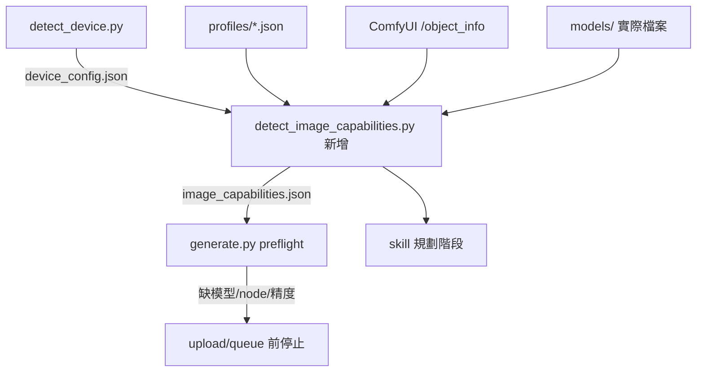

# 模型設定檔（model profile）設計草案

狀態：**第 1–4 階段已完成（離線驗證），第 5、6 階段需要實機**。分支 `feature/model-profiles`。實作時每個階段都要走 `skills/comfyui-new-tool-checklist/SKILL.md`。

第 1 階段落地內容：`tools_src/comfyui_pipeline/profiles/{sdxl_standard,sd15_light}.json`、`profiles.py`（讀取與格式驗證）、`image_graphs.py` 改由設定檔取得 SDXL/SD1.5 模型檔名與取樣參數（FLUX.2 維持原樣）、`verify_portable_install.py` 核對部署端設定檔。`tests/fixtures/image_graphs_golden.json` 以重構前程式碼產生，鎖住 4 個 tier 共 99 組 graph 逐欄位不變。底模 checkpoint 與預設解析度仍讀 `device_config.json`，設定檔的 `resolution.by_memory` 目前只由測試確認與 `detect_device.py` 的 `TIERS` 一致，尚未取代它。

第 2 階段落地內容：
- `detect_device.py` 新增 `platform_key`、`usable_memory_mb`、`memory_kind`、`compute_capability`、`precision_support`；`verify_portable_install.py` 一併比對，舊版 `device_config.json` 會被判為過期。
- 設定檔的每個模型加上 `nodes`（需要的 node class），`controlnet.union` 標為 `experimental`；`controlnet.*` 群組只由非實驗性成員滿足。測試確保 golden graph 用到的非 Core node 都有被設定檔宣告。
- `profiles.py` 新增 `task_requirements`、`platform_eligibility`、`effective_validation`（依平台紀錄、task 涵蓋與 `min_verified_memory_mb` 降級）。
- 新增 `detect_image_capabilities.py` → `image_capabilities.json`（schema 見第 5 節；`default_profile` 目前等於 tier 對應且已安裝的設定檔，第 3 階段才開放主動選擇）。
- `generate.py` 的圖片 dispatch 抽成 `_build_image_task_graph()`；`preflight_image_task()` 以佔位檔名先組出同一份 graph，逐節點比對 `/object_info` 的 node 與 loader 模型選單，缺任何一項都在上傳前停止。刻意不另寫「task→模型」規則，避免與 builder 分歧。
- 與第 5 節的差異：`verify_portable_install.py` 核對 `image_capabilities.json` 指紋延到第 3 階段。preflight 的 `/object_info` 格式判讀（舊式 `[[...]]` 與 `["COMBO", {"options": [...]}]`）只有離線測試，需在初始化時實機確認。

第 3 階段落地內容：
- `generate.py` 新增 `--profile`、`--image-config`；`resolve_image_profile()` 依 `--profile` → `image_capabilities.json` 的 `default_profile` → tier 對應決定設定檔，並在上傳前檢查設定檔存在、平台資格、task 是否提供、快照指紋是否過期；驗證狀態非 `verified` 只提醒。
- `image_graphs.py` 新增 `ACTIVE_PROFILE_ID`：選了設定檔時底模、預設解析度（依 `usable_memory_mb`）與 SDXL add-on 閘門由設定檔決定；沒選時維持 tier 行為，golden fixture 不變。圖片 CLI 的 `--width`/`--height` 預設改為 `None`，由 builder 補值。
- `--style` 在選了設定檔時改看設定檔的 `variants`。
- `detect_image_capabilities.py --default-profile`：明確選用時必須符合平台且底模已裝，不自動退回。
- `device_fingerprint` 移到 `profiles.py` 共用；`verify_portable_install.py` 核對 `image_capabilities.json`（指紋、default_profile 資格與底模檔案），新增 `--require-image`；`local_config.json` 可寫 `image_config`。

第 4 階段落地內容（只改文件）：
- `comfyui-art-gen`：「目前支援的 tier」改為「這台機器能跑什麼」，規劃前先讀 `image_capabilities.json`（可用性、`validation`、`features`），檔案不存在才退回 tier；決策順序第 2 步改為依快照判斷並禁止自行換設定檔。
- `comfyui-video-gen`、`comfyui-character-animation-workflow`：規劃鏡頭表／動作表之前先確認圖片與影片能力，缺關鍵能力在規劃階段就停下告知。
- `comfyui-install`：新增步驟 4b（下載模型前列出符合平台的設定檔與驗證狀態讓使用者選）、步驟 8 依設定檔安裝、收尾分三層回報、smoke 後依情境 C 補平台驗證紀錄。
- `comfyui-new-tool-checklist`：新增「情境 B：新增模型設定檔」「情境 C：在新平台或新記憶體級距驗證既有設定檔」。
- 調校經驗集中到 `skills/comfyui-art-gen/reference/profiles/<id>.md`，設定檔 `notes_ref` 指過去（測試確認檔案存在）；`models.md` 的使用眉角改為連結。

## 1. 要解決的問題

現況是 `tools_src/detect_device.py` 的 `TIERS` 依 VRAM 挑 tier，但 tier 只決定底模檔名與預設解析度：

1. ControlNet、IPAdapter、CLIP Vision、`--style` 底模、取樣參數都寫死成 SDXL 值（`comfyui_pipeline/image_graphs.py`）。
2. tier 描述的是「硬體撐得起」，不是「這台實際裝了什麼」；SDXL add-on 在 upload/queue 前沒有 `/object_info` preflight。
3. 驗證狀態（已驗證／實驗性／未驗證）只寫在 Markdown，程式與 skill 讀不到。
4. 調校經驗（Pony 的 score 標籤、Juggernaut 建議尺寸）綁在檔名與散落文件上。
5. 無法讓大機器主動選較小的管線；手改 `device_config.json` 會被 `verify_portable_install.py` 判 FAIL。
6. 驗證紀錄（`docs/tested-versions.md`）只有一台 Windows + CUDA 機器；macOS MPS、Linux、CPU 路線沒有區分「能跑」與「驗過」。

目標：**依使用者設備提供可選的管線，並讓經驗綁在設定檔 × 平台上，而不是綁在單一機器上**，使用者不必重跑調校，只需做本機 smoke test。

## 2. 核心概念：四層分離

| 層 | 回答的問題 | 載體 | 誰維護 | 版控 |
|---|---|---|---|---|
| 平台（platform） | 這台是什麼 OS／加速後端／記憶體？ | `device_config.json`（沿用，擴充欄位） | 偵測器產生 | 否 |
| 設定檔（profile） | 一組相容模型 + graph 參數 + 可用 task | `tools_src/comfyui_pipeline/profiles/*.json` | 維護者 | 是 |
| 驗證（validation） | 這個設定檔在哪些平台驗過哪些 task？ | 設定檔內 `validation` 區塊 + `docs/tested-versions.md` 證據 | 維護者 | 是 |
| 安裝（install） | 這台實際裝好哪些設定檔、哪些 task 可用？ | `image_capabilities.json`（新增，比照影片） | 偵測器產生 | 否 |

**JSON 分兩類，不可混用**：

- **靜態、全平台共用**：`profiles/*.json`。每台機器拿到的內容完全相同，隨 repo 版控與部署；不依設備產生、不在目標機修改。換設備時不換這份，換的是「選哪一份」。
- **動態、每台機器產生**：`device_config.json`、`image_capabilities.json`、`video_capabilities.json`。由偵測器依該機硬體與實際安裝產生，不進版控、不可複製到其他機器。

不依設備產生「客製版設定檔」，否則每台機器的模型組合與參數都不同，驗證經驗無法累積，等於每台都要重新調校。

選擇規則：**可選設定檔 = 平台符合 `requirements` ∩ 已安裝完整 ∩ 驗證狀態不是 `unsupported`**。

tier 不刪除，降格成「這台最多建議到哪個設定檔」的提示，保留相容。

**tier 與設定檔的對應（已決定）**：`sdxl_high`、`sdxl`、`sdxl_light` 使用同一顆底模、同一套 add-on 與同一組取樣參數，因此**併成單一設定檔 `sdxl_standard`**，不各開一份。三者原本的差異改由下列方式表達：

| 原差異 | 新做法 |
|---|---|
| 預設解析度 1024／768 | 設定檔 `resolution.by_memory` 依可用記憶體挑預設值 |
| 8–12GB 可先不裝 Depth/OpenPose | 這些模型本來就是 `optional`，沒裝只影響依賴它們的 task |
| torch index cu130／cu126 | 屬安裝環境，由 install 流程依平台與驅動決定，不寫進設定檔 |
| 低記憶體機器是否驗證過 | 驗證紀錄加 `min_verified_memory_mb`（見 4.1） |

`sd15` 使用不同架構的模型組，維持獨立設定檔 `sd15_light`。

## 3. 多平台模型

### 3.1 平台識別

`device_config.json` 擴充（沿用既有欄位、只加不改）：

```json
{
  "os": "windows | macos | linux",
  "arch": "x86_64 | arm64",
  "backend": "cuda | mps | cpu",
  "gpu_name": "...",
  "memory_mb": 16376,
  "memory_kind": "dedicated | unified | system",
  "usable_memory_mb": 16376,
  "compute_capability": "8.9",
  "precision_support": ["fp32", "fp16", "bf16", "fp8"],
  "tier": "sdxl"
}
```

- `platform_key` = `<os>-<backend>`，例如 `windows-cuda`、`linux-cuda`、`macos-mps`、`linux-cpu`。驗證狀態以這個 key 記錄，不以機器名稱記錄。
- `usable_memory_mb`：CUDA 取獨立 VRAM；Apple Silicon 沿用現有 `APPLE_DIFFUSION_MEMORY_RATIO = 0.5`；CPU 取系統記憶體的保守比例。
- `precision_support` 不能從 OS 推斷，要依後端與硬體判斷：
  - CUDA：依 compute capability（例如 fp8 需 Ada 8.9+，nvfp4 需 Blackwell 12.0）。
  - MPS：目前以 fp16/fp32 為準；fp8、int8 convrot、nvfp4 預設視為不支援，除非該設定檔在 `macos-mps` 有驗證紀錄。
  - CPU：fp32 為準。
- 預留 `rocm`、`xpu`、`directml` 為合法 backend 值，但沒有驗證紀錄前一律 `unsupported`，偵測到時照實寫入、不假裝成 `cuda`。

### 3.2 平台差異的處理原則

| 差異 | 做法 |
|---|---|
| 路徑分隔、`python.exe` 位置 | 全部走 `pathlib`／`local_config.json`，設定檔內只寫 ComfyUI 模型子目錄與檔名，不寫絕對路徑 |
| 精度／量化格式 | 設定檔每顆模型標 `precision`，選擇時與 `precision_support` 比對；不相符就判設定檔不可用，不自動換精度 |
| loader node（`CheckpointLoaderSimple`、`UNETLoader`、GGUF loader） | 設定檔宣告 `loader`，graph builder 依此組 node；preflight 用 `/object_info` 確認 node 存在 |
| attention／加速選項（xformers、sage-attention） | 不寫進設定檔；屬 ComfyUI 啟動參數，由 install skill 依平台處理，不影響 graph 契約 |
| 記憶體 | 設定檔寫 `min_usable_memory_mb`；unified memory 用折算後數值比較 |
| 輸出一致性 | 不承諾跨平台逐位元一致；驗證的是「品質通過人工驗收」，不是 hash 相同 |
| 腳本檔案 | `.ps1` 仍需 UTF-8 BOM（Windows PowerShell 5.1）；macOS／Linux 用 POSIX shell 或 Python，不共用 shell 腳本 |

## 4. 設定檔結構

檔案：`tools_src/comfyui_pipeline/profiles/<profile_id>.json`，隨 `comfyui_pipeline/` 一起部署到 `<ComfyUI>/tools/`，由 `verify_portable_install.py` 做原始碼同步檢查。

```json
{
  "schema_version": 1,
  "id": "sdxl_standard",
  "display_name": "SDXL 標準",
  "family": "sdxl",
  "kind": "image",

  "requirements": {
    "backends": ["cuda", "mps"],
    "min_usable_memory_mb": 8000,
    "precision": ["fp16"]
  },

  "models": {
    "checkpoint": {"dir": "checkpoints", "file": "sd_xl_base_1.0.safetensors", "loader": "CheckpointLoaderSimple", "precision": "fp16"},
    "controlnet.canny": {"dir": "controlnet", "file": "controlnet-canny-sdxl-1.0.safetensors", "optional": true},
    "controlnet.pose": {"dir": "controlnet", "file": "controlnet-openpose-sdxl-1.0.safetensors", "optional": true},
    "controlnet.depth": {"dir": "controlnet", "file": "controlnet-depth-sdxl-1.0.safetensors", "optional": true},
    "ipadapter": {"dir": "ipadapter", "file": "ip-adapter-plus_sdxl_vit-h.safetensors", "optional": true},
    "clip_vision": {"dir": "clip_vision", "file": "CLIP-ViT-H-14-laion2B-s32B-b79K.safetensors", "optional": true}
  },

  "sampling": {"steps": 25, "cfg": 7.0, "sampler": "euler", "scheduler": "normal"},
  "resolution": {
    "native": [1024, 1024],
    "multiple_of": 8,
    "by_memory": [
      {"min_usable_memory_mb": 12000, "default": [1024, 1024]},
      {"min_usable_memory_mb": 8000, "default": [768, 768]}
    ]
  },

  "tasks": {
    "concept": {"requires": ["checkpoint"]},
    "pose_only": {"requires": ["checkpoint", "controlnet.*"], "nodes": ["ControlNetLoader"]},
    "style_lock": {"requires": ["checkpoint", "ipadapter", "clip_vision"], "nodes": ["IPAdapterModelLoader"]}
  },

  "notes_ref": "skills/comfyui-art-gen/reference/profiles/sdxl_standard.md",

  "validation": {
    "windows-cuda": {"status": "verified", "tasks": ["concept", "pose_only", "style_lock"], "min_verified_memory_mb": 16000, "evidence": "docs/tested-versions.md#xu-nano-pc-manifest"},
    "macos-mps": {"status": "unverified"},
    "linux-cuda": {"status": "unverified"}
  }
}
```

規則：

- `tasks` 是白名單。沒列就代表這個設定檔不提供該 task，skill 不提。
- `requires` 只引用 `models` 的 key；`optional: true` 的模型沒裝時，只讓依賴它的 task 不可用，不讓整個設定檔不可用。
- `sampling` 取代目前 `image_graphs.py` 的寫死值；task 可在 `tasks.<name>.sampling` 局部覆寫。
- `--style` 變體不另開設定檔，放 `variants`（沿用同一組 add-on），各自帶 `sampling`／`resolution`／`prompt_prefix`（例如 Pony 的 score 標籤）與獨立 `validation`。
- 調校經驗寫在 `notes_ref` 指向的 Markdown，一個設定檔一份，取代散落在 `models.md`、`教學.md` 的段落（原處改成連結）。
- FLUX.2、影片 backend 也收斂成設定檔（`kind: "image"`／`"video"`），但**第一階段不動**，只保留結構相容。

### 4.1 驗證狀態定義

| status | 意義 | skill 行為 |
|---|---|---|
| `verified` | 該平台實機跑過 `tasks` 內所列 task 並通過人工驗收，證據寫入 `docs/tested-versions.md` | 直接使用 |
| `experimental` | 至少一次 smoke 能出圖，但品質／穩定性未完整驗收 | 使用前告知「實驗性、結果可能較差」 |
| `unverified` | 規格上相容，沒有任何實機紀錄 | 預設不列為選項；使用者明確要求才可試，並告知風險 |
| `unsupported` | 已知不相容（精度、node、OOM） | 不列、不可強制 |

未列出的 `platform_key` 一律視為 `unverified`。驗證狀態以 **task 為單位**：同一設定檔在 `macos-mps` 可以 `concept` 已驗證、`pose_only` 仍未驗證。

`min_verified_memory_mb`：驗證時使用的最低可用記憶體。偵測時若這台機器的 `usable_memory_mb` 低於此值，該平台的 `verified`／`experimental` 一律降為 `unverified` 並註明原因，避免把 16GB 的驗證結果套到 8GB 機器（可能 OOM）。目前唯一驗證機是 16GB，所以 8–12GB 機器使用 `sdxl_standard` 時會顯示為未驗證，直到補上該記憶體級距的實測紀錄。

## 5. 偵測與選擇流程



`image_capabilities.json`（machine-specific，不進版控）：

```json
{
  "schema_version": 1,
  "platform_key": "macos-mps",
  "device_fingerprint": "...",
  "default_profile": "sdxl_standard",
  "profiles": {
    "sdxl_standard": {
      "eligible": true,
      "installed": true,
      "tasks": {
        "concept": {"available": true, "validation": "unverified"},
        "pose_only": {"available": false, "reason": "missing controlnet-openpose-sdxl-1.0.safetensors"}
      }
    },
    "sd15_light": {"eligible": true, "installed": false}
  }
}
```

- 偵測器只掃描，不下載（與 `detect_video_capabilities.py` 相同原則）。
- `default_profile`：預設選「可用且驗證狀態最高、記憶體需求最高」的設定檔；使用者可在安裝時明確指定較小的設定檔，寫入這裡，**不再需要手改 `device_config.json`**。
- `generate.py` 新增 `--profile <id>`；未給則用 `default_profile`。preflight 依設定檔檢查模型、node、精度，缺任何一項都在 upload/queue 前停止。
- `verify_portable_install.py`：`device_config.json` 仍與即時偵測比對；另核對 `image_capabilities.json` 的 `device_fingerprint` 與實際模型存在性，`default_profile` 不再與 tier 綁定比對。

## 6. Skill 流程調整

### `comfyui-install`
1. 偵測平台 → 列出**符合平台的設定檔**與各自驗證狀態、空間需求。
2. 使用者選設定檔（預設建議最高已驗證者；可主動選較小的）。
3. 只安裝該設定檔需要的模型；`optional` 模型逐項詢問。
4. 跑 `detect_image_capabilities.py` → 對該設定檔每個 `verified`／`experimental` task 至少跑一次 smoke。
5. 收尾回報分三層：原始碼同步 PASS／可用 task／本機 smoke 通過的 task。

### `comfyui-art-gen` / `comfyui-video-gen`
- 決策順序第 2 步從「看 tier」改成「讀 `image_capabilities.json`／`video_capabilities.json`，確認 task 在目前設定檔可用與驗證狀態」。
- `experimental`／`unverified` task 依 4.1 表告知使用者。
- 讀設定檔的 `notes_ref` 取得 prompt 慣例，不再從通用文件記憶。

### `comfyui-character-animation-workflow`
- 「開始前固定確認」新增第 0 步：一次讀取圖片與影片能力清單，確認整條路線（靜幀 task + 每個動作的影片 task）都可用；不可用的動作在動作表階段就排除或告知，不等到生成時才失敗。

### `comfyui-new-tool-checklist`
- 新增「新增設定檔」與「在新平台驗證既有設定檔」兩種情境；後者只需 smoke + 人工驗收 + 更新 `validation` 與 `tested-versions.md`，不需改程式碼。

## 7. 分階段實作

| 階段 | 內容 | 行為變化 |
|---|---|---|
| 0 | 本草案定稿 | 無 |
| 1 | 把現有 SDXL／SD1.5 寫死值搬進 `sdxl_standard`（涵蓋原 `sdxl_high`／`sdxl`／`sdxl_light`）、`sd15_light` 兩個設定檔；graph builder 改讀設定檔，三個 SDXL tier 的預設解析度仍須與現行相同 | **無**（輸出 graph 必須與現行逐欄位相同，用測試鎖住） |
| 2 | `device_config.json` 擴充平台欄位；新增 `detect_image_capabilities.py`；`generate.py` SDXL add-on preflight | 缺模型時提早停止（第一輪指出的缺口） |
| 3 | `--profile`、`default_profile`；更新 `verify_portable_install.py` | 可主動選較小設定檔 |
| 4 | skill 文件改寫；`notes_ref` 經驗文件搬遷 | agent 規劃時就知道可用範圍 |
| 5 | 引入第一個真正的輕量設定檔（候選：SDXL 蒸餾版或 SD1.5 + 對應 add-on），走完整新工具清單 | 新能力 |
| 6 | 在 `macos-mps` 等平台補驗既有設定檔 | 只更新驗證紀錄 |

測試原則：階段 1–3 的離線測試不依賴 GPU／ComfyUI，需在 Windows、macOS、Linux 三平台的 CI 上都能跑（`.github/workflows/ci.yml` 視需要加 matrix）；平台偵測以注入假 `platform`／`nvidia-smi`／`sysctl` 輸出測試，不依賴 CI 機器實際硬體。

## 8. 待決問題

1. ~~設定檔用 JSON 還是 Python dict？~~ **已決定：JSON**，另寫測試檢查格式。設定檔是全平台共用的靜態檔，不依設備產生（見第 2 節）。
2. ~~`sdxl_light` 要保留成獨立設定檔嗎？~~ **已決定：併入 `sdxl_standard`**（`sdxl_high` 同樣處理），解析度依記憶體調整，驗證紀錄加 `min_verified_memory_mb`（見第 2 節、4.1）。
3. 輕量設定檔第一個候選是誰？需先用 `comfyui-pipeline-review` 盤點，不在本草案決定。
4. 影片 backend 何時收斂成同一套設定檔格式，或維持 `video_capabilities.json` 現狀只對齊欄位命名？
5. `macos-mps` 的 fp8 / int8 支援狀況隨 PyTorch 版本變動，精度判斷要不要依 torch 版本查表？
